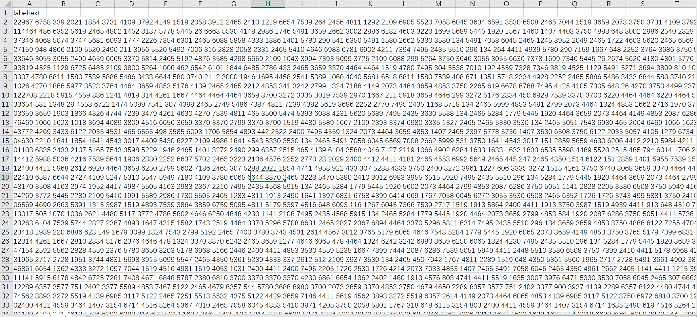

# 01 赛题理解

[TOC]

- 赛题名称：零基础入门NLP之新闻文本分类
- 赛题目标：掌握iNLP的预处理、模型构建和模型训练等知识点。
- 赛题任务：以自然语言处理为背景，对新闻文本进行分类（一个典型的字符识别问题）

## 数据

### 格式

train：testA：test B = 20w:5w:5w



数据是经过转码后的数据，避免人工标注，以及通过其他手段（其他模型等）获取结果。

### 标签

'科技': 0, '股票': 1, '体育': 2, '娱乐': 3, '时政': 4, '社会': 5, '教育': 6, '财经': 7, '家居': 8, '游戏': 9, '房产': 10, '时尚': 11, '彩票': 12, '星座': 13

* 正确即可，所以不妨碍是哪一类型；
* 但已知类型有利于混淆矩阵分析。

### 读取

```python
# tab 分割
train_df = pd.read_csv('../input/train_set.csv', sep='\t')
```

## 评估

f1-score（精确率与召回率的调和平均数）
$$
f1 = 2* \frac{precision*recall}{precision+recall}
$$

```python
from sklearn.metrics import f1_score
f1_score(y_true, y_pred, average='macro')  # 此处选择权重相同，算术平均
```


## 模型

此处：词编码+分类器

### TF-IDF + 机器学习分类器

直接使用TF-IDF对文本提取特征，并使用分类器进行分类。在分类器的选择上，可以使用SVM、LR、或者XGBoost。

### FastText

FastText是入门款的词向量，利用Facebook提供的FastText工具，可以快速构建出分类器。

### WordVec + 深度学习分类器

WordVec是进阶款的词向量，并通过构建深度学习分类完成分类。深度学习分类的网络结构可以选择TextCNN、TextRNN或者BiLSTM。

（预训练还是合一起？）

### Bert词向量

Bert是高配款的词向量，具有强大的建模学习能力。

（计算问题，是不是会缩小bert的规模？）