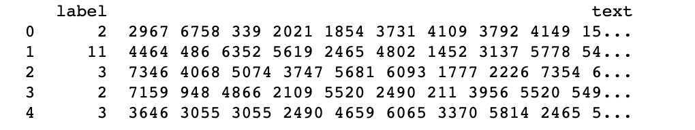
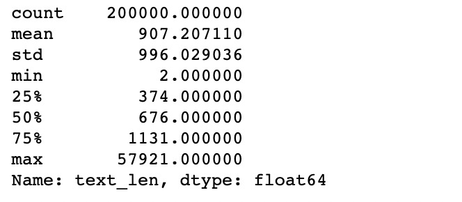
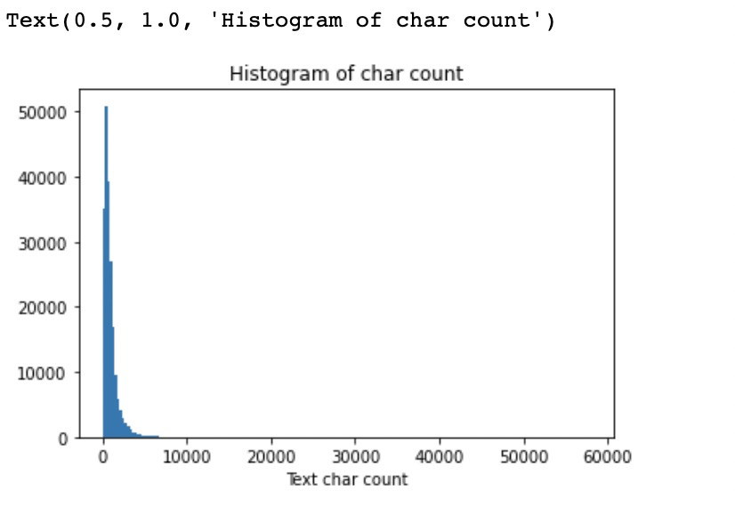
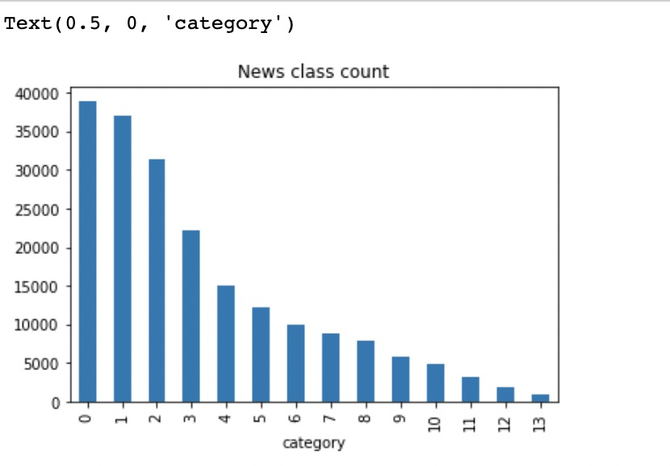
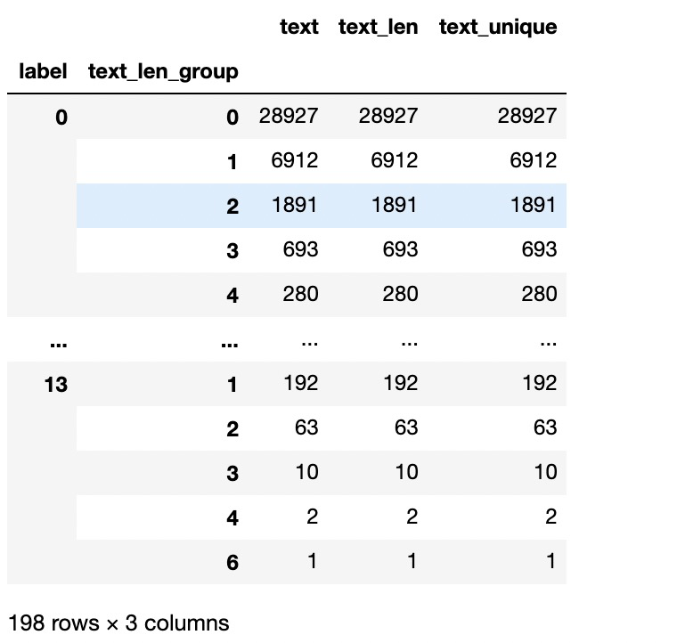
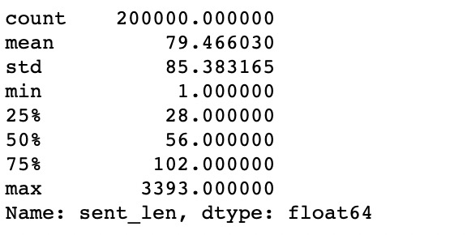
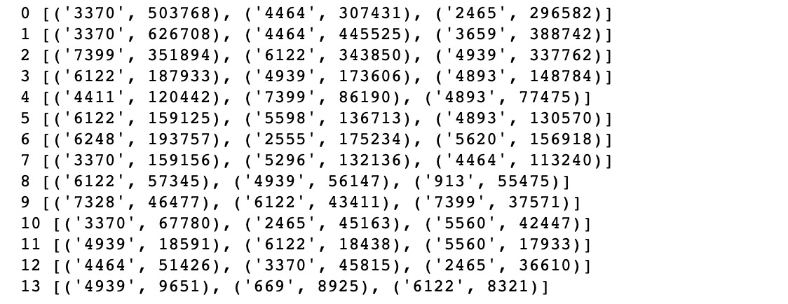
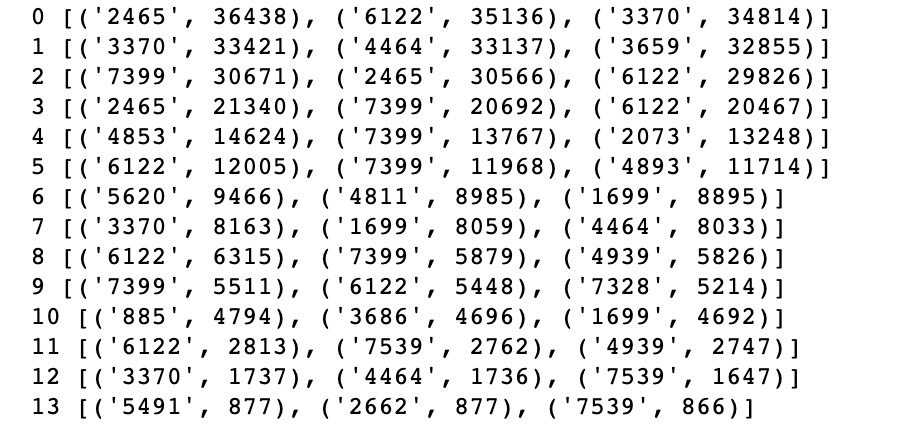

# 02 数据读取与数据分析

[toc]

## 数据读取

```python
import pandas as pd
train_df = pd.read_csv('./input/train_set.csv', sep='\t', nrows=200000)
print(train_df.head())
```



## 数据分析

### 文本长度

```python
train_df['text_len'] = train_df['text'].apply(lambda x: len(x.split(' ')))
print(train_df['text_len'].describe())
```



```python
train_df[train_df['text_len']<2000]['label'].count()/train_df['label'].count()
```

0.920165

**2000字符以上的占比在92%以上**

```python
from matplotlib import pyplot as plt 

_ = plt.hist(train_df['text_len'], bins=200)
plt.xlabel('Text char count')
plt.title("Histogram of char count")
```



### 分类特征

```python
train_df['label'].value_counts().plot(kind='bar')
plt.title('News class count')
plt.xlabel("category")
```



**分类不均衡**

```python
train_df['text_len_group'] = train_df['text_len'].apply(lambda x: x//1000)
train_df.groupby(['label','text_len_group']).count()
```



### 字符特征

```python
from collections import Counter

all_lines = ' '.join(list(train_df['text']))
word_count = Counter(all_lines.split(" "))
word_count = sorted(word_count.items(), key=lambda d:d[1], reverse = True)

print(len(word_count))
# 6869

print(word_count[0])
# ('3750', 7482224)

print(word_count[-1])
# ('3133', 1)
```

```python
# 字符在多少文本中出现
train_df['text_unique'] = train_df['text'].apply(lambda x: ' '.join(list(set(x.split(' ')))))
all_lines = ' '.join(list(train_df['text_unique']))
word_count = Counter(all_lines.split(" "))
word_count = sorted(word_count.items(), key=lambda d:int(d[1]), reverse = True)

print(word_count[0])
# ('3750', 197997)

print(word_count[1])
# ('900', 197653)

print(word_count[2])
# ('648', 191975)
```

**字符出现差别较大（高频高覆盖率的词汇可能没有什么实际意义）**

假设出现覆盖率为前三的字符为标点符号，根据正则表达式可以得到包含多少句子：

```python
import re
train_df['sent_len'] = train_df['text'].apply(lambda x: len([x for x in re.split('3750|900|648', x) if x.strip()!='']))
print(train_df['sent_len'].describe())
```



每类新闻出现最多次数的字符是：

```python
for i in range(14):
    all_lines = ' '.join(list(train_df[train_df['label']==i]['text']))
    word_count_label = Counter([x for x in all_lines.split(" ") if x not in ['3750', '648', '900']])
    print(i, word_count_label.most_common(1))
```



每类新闻出现覆盖最多的字符是：

```python
for i in range(14):
    all_lines = ' '.join(list(train_df[train_df['label']==i]['text_unique']))
    word_count_label = Counter([x for x in all_lines.split(" ") if x not in ['3750', '648', '900']])
    print(i, word_count_label.most_common(1))
```



覆盖次数高的与总词频高的差距还是蛮大的。

## 结论

### 数据分析的结论

1. 赛题中每个新闻包含的字符个数平均为1000个，还有一些新闻字符较长；
2. 赛题中新闻类别分布不均匀，科技类新闻样本量接近4w，星座类新闻样本量不到1k；
3. 赛题总共包括7000-8000个字符；

因此：

1. 每个新闻平均字符个数较多，可能需要截断；
2. 由于类别不均衡，会严重影响模型的精度，需要进行处理。