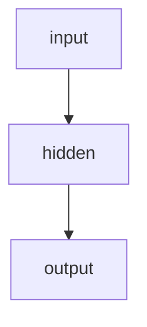
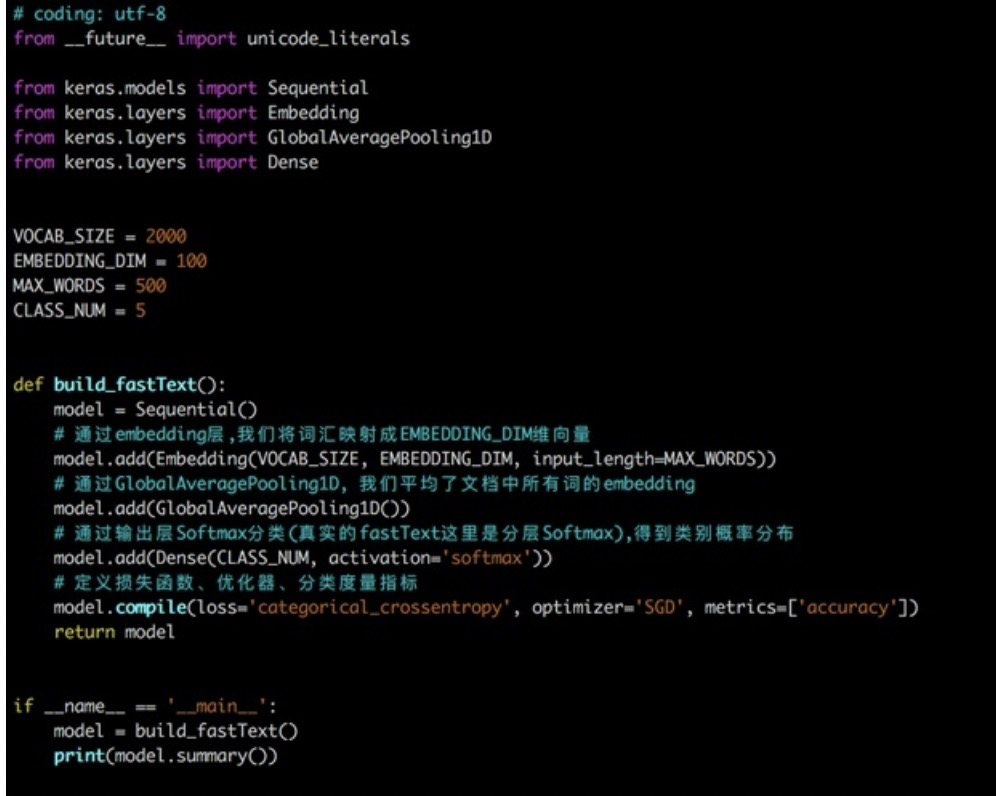
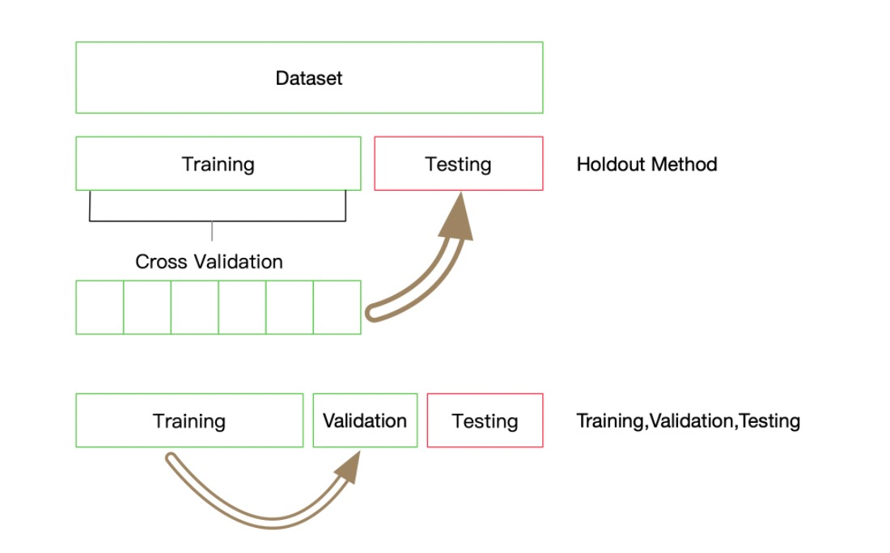

# 04 基于深度学习的文本分类

[toc]

与传统机器学习不同，深度学习既提供特征提取功能，也可以完成分类的功能。（特征工程相对而言不那么重要）

## 现有文本表示方法的缺陷

在上一章节的几种文本表示方法：

- One-hot
- Bag of Words
- N-gram
- TF-IDF

或多或少存在一定的问题：转换得到的向量维度很高，需要较长的训练实践；没有考虑单词与单词之间的关系，只是进行了统计。

## 深度学习用于文本表示

与这些表示方法不同，深度学习也可以用于文本表示，还可以将其映射到一个低纬空间。其中比较典型的例子有：FastText、Word2Vec和Bert。

### 1. FastText

FastText是一种典型的深度学习词向量的表示方法，它非常简单通过Embedding层将单词映射到稠密空间，然后将句子中所有的单词在Embedding空间中进行平均，进而完成分类操作。

#### i 网络结构

所以FastText是一个三层的神经网络，输入层、隐含层和输出层。





#### ii 使用

FastText在文本分类任务上，是优于TF-IDF的：

- FastText用单词的Embedding叠加获得的文档向量，将相似的句子分为一类
- FastText学习到的Embedding空间维度比较低，可以快速进行训练

参数：

```python
def train_supervised(input, lr=0.1, dim=100, 
                   ws=5, epoch=5, minCount=1, 
                   minCountLabel=0, minn=0, 
                   maxn=0, neg=5, wordNgrams=1, 
                   loss="softmax", bucket=2000000, 
                   thread=12, lrUpdateRate=100,
                   t=1e-4, label="__label__", 
                   verbose=2, pretrainedVectors=""):
  """
  训练一个监督模型, 返回一个模型对象

  @param input: 训练数据文件路径
  @param lr:              学习率
  @param dim:             向量维度
  @param ws:              cbow模型时使用
  @param epoch:           次数
  @param minCount:        词频阈值, 小于该值在初始化时会过滤掉
  @param minCountLabel:   类别阈值，类别小于该值初始化时会过滤掉
  @param minn:            构造subword时最小char个数
  @param maxn:            构造subword时最大char个数
  @param neg:             负采样
  @param wordNgrams:      n-gram个数
  @param loss:            损失函数类型, softmax, ns: 负采样, hs: 分层softmax
  @param bucket:          词扩充大小, [A, B]: A语料中包含的词向量, B不在语料中的词向量
  @param thread:          线程个数, 每个线程处理输入数据的一段, 0号线程负责loss输出
  @param lrUpdateRate:    学习率更新
  @param t:               负采样阈值
  @param label:           类别前缀
  @param verbose:         进度条输出
  @param pretrainedVectors: 预训练的词向量文件路径, 如果word出现在文件夹中初始化不再随机
  @return model object

  """
  pass
```

使用：

```python
import pandas as pd
from sklearn.metrics import f1_score

# 转换为FastText需要的格式
train_df = pd.read_csv('../data/train_set.csv', sep='\t', nrows=15000)
train_df['label_ft'] = '__label__' + train_df['label'].astype(str)
train_df[['text','label_ft']].iloc[:-5000].to_csv('train.csv', index=None, header=None, sep='\t')

import fasttext
model = fasttext.train_supervised('train.csv', lr=1.0, wordNgrams=2, 
                                  verbose=2, minCount=1, epoch=25, loss="hs")

val_pred = [model.predict(x)[0][0].split('__')[-1] for x in train_df.iloc[-5000:]['text']]
print(f1_score(train_df['label'].values[-5000:].astype(str), val_pred, average='macro'))
# 0.82
```

```python
# 修改训练集数据量 训练集20000 验证集5000
# 还是受限于样本量，所以数据不足
model1 = fasttext.train_supervised('train.csv', lr=1.0, wordNgrams=2, 
                                  verbose=2, minCount=1, epoch=25, loss="hs")
# 0.8642834818045703
model2 = model = fasttext.train_supervised('train.csv', lr=1.0, wordNgrams=3, 
                                  verbose=2, minCount=2, epoch=25, loss="hs")
# 0.8652514343494861
model3 = fasttext.train_supervised('train.csv', lr=1.0, wordNgrams=3, dim=200,
                                  verbose=2, minCount=2, epoch=25, loss="hs")
# 0.8656534688095697
```


## 如何使用验证集调参

在使用TF-IDF和FastText中，有一些模型的参数需要选择，这些参数会在一定程度上影响模型的精度，那么如何选择这些参数呢？

- 通过阅读文档，要弄清楚这些参数的大致含义，那些参数会增加模型的复杂度

- 通过在验证集上进行验证模型精度，找到模型在是否过拟合还是欠拟合

  

这里我们使用10折交叉验证，每折使用9/10的数据进行训练，剩余1/10作为验证集检验模型的效果。这里需要注意每折的划分必须保证标签的分布与整个数据集的分布一致。

通过10折划分，我们一共得到了10份分布一致的数据，索引分别为0到9，每次通过将一份数据作为验证集，剩余数据作为训练集，获得了所有数据的10种分割。不失一般性，我们选择最后一份完成剩余的实验，即索引为9的一份做为验证集，索引为0-8的作为训练集，然后基于验证集的结果调整超参数，使得模型性能更优。

```python
label2id = {}
for i in range(total):
    label = str(all_labels[i])
    if label not in label2id:
        label2id[label] = [i]
    else:
        label2id[label].append(i)
```

